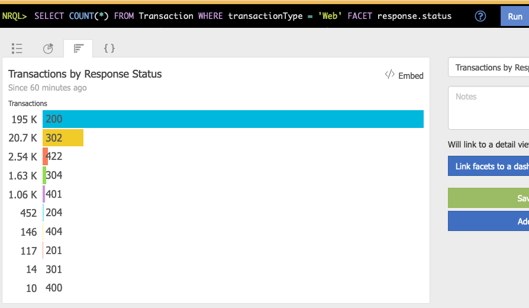

# Guide

This guide provides a walkthrough for getting started with using New Relic Dashboard builder to define and manage your New Relic dashboards.

## Basic Query and Dashboard Definitions

New Relic dashboards are composed of one or more widgets. Each widget has a size and location on the dashboard as well as an NRQL query that defines the data that is displayed by the widget.

Suppose we wanted to create a dashboard consisting the following widget:



This dashboard could be defined in YAML as

```yaml
dashboards:
  sample-dashboard:
    title: Sample Dashboard
    widgets:
      - widget:
        query:
          title: Transactions by Response Status
          nrql: SELECT COUNT(*) FROM Transaction WHERE transactionType = 'Web' FACET response.status
          visualization: facet_bar_chart
        row: 1
        column: 1
        width: 3
        height: 2
```

If we wanted to add another widget to this dashboard, we could simply extend the definition to include a second widget

```yaml
dashboards:
  sample-dashboard:
    title: Sample Dashboard
    widgets:
      - widget:
        query:
          title: Transactions by Response Status
          nrql: SELECT COUNT(*) FROM Transaction WHERE transactionType = 'Web' FACET response.status
          visualization: facet_bar_chart
        row: 1
        column: 1
        width: 3
        height: 2
      - widget:
        query:
          title: Transaction Errors
          nrql: SELECT COUNT(*) FROM TransactionError WHERE transactionType = 'Web' COMPARE WITH 1 week ago
          visualization: billboard_comparison
        row: 3
        column: 1
        width: 1
        height: 1
```

!!! note
    New Relic Dashboard Builder identifies dashboards by their title. Running the tool will overwrite the configuration for any existing dashboards that have a title that matches any dashboards defined in the YAML file. If no dashboard exists with a title, then a new dashboard will be created.

## Sharing Queries Across Multiple Dashboards

If you have a query that you would like to display on multiple dashboards, then you can define the query in a `queries` section and refer to that query definition from all dashboards. Queries can be specified once in a `queries` section and re-used across many dashboards to avoid duplicating the query definition.

```yaml
queries:
  transactions-by-response-status-query:
    title: Transactions by Response Status
    nrql: SELECT COUNT(*) FROM Transaction WHERE transactionType = 'Web' FACET response.status
    visualization: facet_bar_chart


dashboards:
  sample-dashboard-1:
    title: Sample Dashboard 1
    widgets:
      - widget:
        query: transactions-by-response-status-query
        row: 1
        column: 1
        width: 3
        height: 2
  
  sample-dashboard-2:
    title: Sample Dashboard 2
    widgets:
      - widget:
        query: transactions-by-response-status-query
        row: 1
        column: 1
        width: 1
        height: 1
```

## Sharing Query Components

Oftentimes components of queries are duplicated across multiple queries and multiple dashboards. This can make maintaining dashboards through the New Relic API cumbersome because of all the duplication. New Relic Dashboard builder allows you to define query components once, combining and reusing the components to create queries with minimal duplication.

New Relic Dashboard Builder supports three types of query components that can be used to form complete NRQL queries.

1. **Conditions** - Specify the conditions used in the `WHERE` clauses of NRQL queries (e.g. `WHERE response.status = 200`)
2. **Output Selections** - Specify the fields and aggregations selected from NRQL queries (e.g. `SELECT COUNT(*)` or `SELECT response.status`)
3. **Displays** - Specify how the data from NRQL queries are displayed by specifying any `SINCE`, `UNTIL`, `WITH TIMEZONE`, `COMPARE WITH`, or `TIMESERIES` clauses

### Conditions

Conditions are specified in a `conditions` section of the YAML definition file using raw NRQL snippets.

```yaml
conditions:
  service-a-rabbit-queues-condition: displayName IN ('/service-a-queue-1', '/service-a-queue-2')

  service-b-rabbit-queues-condition: displayName IN ('/service-b-queue-1', '/service-b-queue-2')
```

Conditions can also be combined using the `and` and `or` combinators to create other conditions

```yaml
conditions:
  service-b-production-rabbit-queues-condition:
    and:
      - condition: service-b-rabbit-queues-condition
      - label.env = 'production

  service-a-production-rabbit-queues-condition:
    and:
      - condition: service-a-rabbit-queues-condition
      - label.env = 'production'

  all-rabbit-queues-condition:
    or:
      - condition: service-a-production-rabbit-queues-condition
      - condition: service-b-production-rabbit-queues-condition
```

### Output Selections

Output selections are specified in the `output-selections` section of the YAML definition file. Output selections consist of raw NRQL snippets.

```yaml
output-selections:
  total-consumers-output: max(queue.consumers)
  total-message-publish-rate-output: max(queue.messagesPublishedPerSecond)
```

### Displays

Displays are specified in the `displays` section of the YAML definition file. Displays consist of an optional raw NRQL snippet and a visualization type.

```yaml
displays:
  timeseries-by-name-display:
    nrql: TIMESERIES FACET displayName
    visualization: faceted_line_chart

  current-value-by-name-display:
    nrql: FACET displayName
    visualization: facet_table
```

### Combining Components into Queries

Altogether, conditions, output selections, and displays can be combined to create queries which can be used in dashboards.

```yaml
conditions:
  service-a-rabbit-queues-condition: displayName IN ('/service-a-queue-1', '/service-a-queue-2')

  service-a-production-rabbit-queues-condition:
    and:
      - condition: service-a-rabbit-queues-condition
      - label.env = 'production'

  service-b-rabbit-queues-condition: displayName IN ('/service-b-queue-1', '/service-b-queue-2')

  service-b-production-rabbit-queues-condition:
    and:
      - condition: service-b-rabbit-queues-condition
      - label.env = 'production'

  all-rabbit-queues-condition:
    or:
      - condition: service-a-production-rabbit-queues-condition
      - condition: service-b-production-rabbit-queues-condition


output-selections:
  total-consumers-output: max(queue.consumers)
  total-message-publish-rate-output: max(queue.messagesPublishedPerSecond)


displays:
  timeseries-by-name-display:
    nrql: TIMESERIES FACET displayName
    visualization: faceted_line_chart

  current-value-by-name-display:
    nrql: FACET displayName
    visualization: facet_table


queries:
  rabbit-queue-consumers-query:
    title: RabbitMQ Queue Consumers
    event: RabbitmqQueueSample
    condition: all-rabbit-queues-condition
    output: total-consumers-output
    display: current-value-by-name-display
  
  rabbit-queue-publish-rate-query:
    title: RabbitMQ Message Publish Rate
    event: RabbitmqQueueSample
    condition: all-rabbit-queues-condition
    output: total-message-publish-rate-output
    display: timeseries-by-name-display

  service-a-rabbit-queue-consumers-query:
    title: RabbitMQ Queue Consumers
    event: RabbitmqQueueSample
    condition: service-a-production-rabbit-queues-condition
    output: total-consumers-output
    display: current-value-by-name-display
  
  service-a-rabbit-queue-publish-rate-query:
    title: RabbitMQ Message Publish Rate
    event: RabbitmqQueueSample
    condition: service-a-production-rabbit-queues-condition
    output: total-message-publish-rate-output
    display: timeseries-by-name-display


dashboards:
  all-services-rabbit-mq-dashboard:
    title: Sample Dashboard
    widgets:
      - widget:
        query: rabbit-queue-publish-rate-query
        row: 1
        column: 1
        width: 3
        height: 1
      - widget:
        query: rabbit-queue-consumers-query
        row: 2
        column: 1
        width: 1
        height: 1
    
  service-a-rabbit-mq-dashboard:
    title: Sample Dashboard 2
    widgets:
      - widget:
        query: service-a-rabbit-queue-publish-rate-query
        row: 1
        column: 1
        width: 3
        height: 1
      - widget:
        query: service-a-rabbit-queue-consumers-query
        row: 2
        column: 1
        width: 1
        height: 1
```